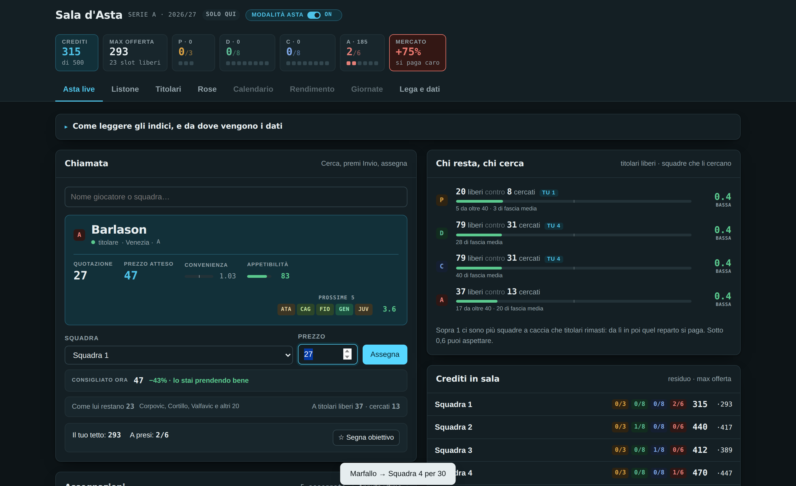
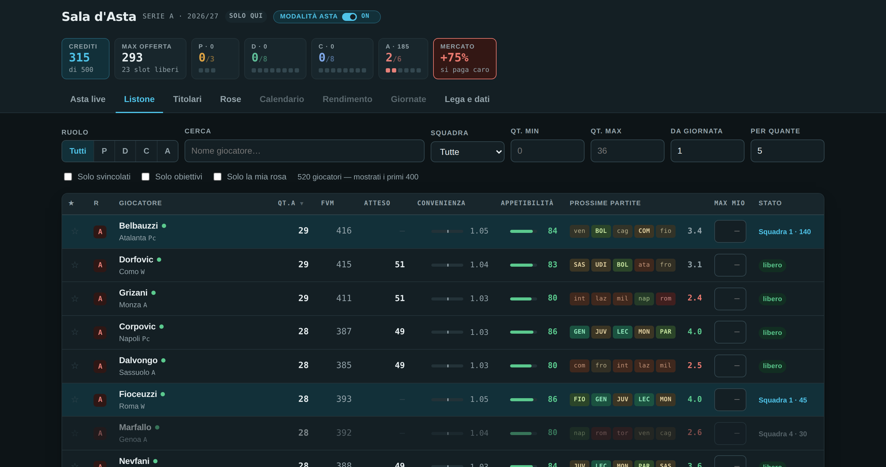

# Fantaregia

Un'app a **file singolo** per condurre l'asta del fantacalcio e poi gestirci la stagione. Si apre con un doppio clic su un `.html`, non ha bisogno di un server, di un account o di una connessione: i dati stanno dentro la pagina e i tuoi restano sul tuo computer.



Non è un altro listone con i filtri. La differenza è che quasi ogni numero qui dentro è stato **verificato contro qualcosa di reale** prima di finire nell'interfaccia, e dove la verifica ha detto "non serve", la funzione non è stata aggiunta. Le prove stanno più in basso, in [Da dove vengono i numeri](#da-dove-vengono-i-numeri).

> **Nel repo non c'è nessun dato.** Il listone, i voti di giornata, le statistiche e il calendario te li procuri tu — sono di chi li pubblica, non miei. Qui trovi il codice e gli strumenti per caricare i tuoi. Vedi [I dati te li porti tu](#i-dati-te-li-porti-tu).

---

## Cosa fa

**Durante l'asta**

- **Prezzo atteso** — quanto un giocatore dovrebbe costare *nella tua lega*, non in una generica: si ricalcola su budget, numero di squadre, slot e piano di spesa. Ad asta iniziata diventa il prezzo *di adesso*, aggiornato sui crediti ancora in circolazione e sui giocatori ancora liberi.
- **Chi resta, chi cerca** — per ogni ruolo, i titolari ancora liberi contro quanti ne servono ancora alle squadre. Sopra 1 quel reparto sta per rincarare; sotto 0,6 puoi aspettare.
- **Console di chiamata** — cerchi, premi Invio, assegni. Mentre digiti il prezzo ti dice di quanto sei sopra il consigliato e quante alternative equivalenti restano libere.
- **Indicatore di mercato** — di quanto la lega sta pagando sopra o sotto il listino, in tempo reale.

**Durante la stagione**

- **Formazione per ognuna delle 38 giornate**, con un punteggio per casella e la frase che lo spiega ("gioca sempre · calendario duro"), e un confronto fra i tuoi giocatori di quel ruolo.
- **Rendimento** dai voti che carichi: presenze, medie, bonus, dettaglio giornata per giornata.
- **Indisponibili** da segnare a mano: escono da tutti gli indici e dalla formazione automatica.
- **Riepilogo d'asta** con un giudizio per ogni rosa, esportabile in Excel e stampabile in due fogli.

**Un interruttore "modalità asta"** riordina il menu: acceso mette davanti le pagine per comprare, spento quelle per giocare le giornate.



---

## Come si costruisce

```bash
git clone https://github.com/FrancescoIrace/fantaregia.git
cd fantaregia
./build.sh
```

Ne esce `Fantaregia.html`: aprilo con un doppio clic. Parte **vuota** e ti chiede un listone, che puoi importare direttamente da *Lega e dati* senza toccare la riga di comando.

Per vedere subito l'app in funzione con dati finti:

```bash
node tools/dati.mjs listone    esempi/listone-esempio.csv
node tools/dati.mjs calendario esempi/calendario-esempio.csv
./build.sh dati/
```

I giocatori di `esempi/listone-esempio.csv` sono **inventati**, generati a sillabe: servono a far vedere come si comporta l'app, non a giocarci.

Per i csv non serve installare niente: basta node. `npm install` serve solo se il tuo listone o le statistiche sono in `.xlsx`.

---

## I dati te li porti tu

Questo repo contiene solo codice. I file veri li scarichi tu, da dove preferisci, e restano sul tuo computer: nessuno di essi viene mai spedito da nessuna parte, perché l'app non parla con nessun server.

| Cosa serve | Dove si trova di solito | Come entra nell'app |
|---|---|---|
| **Listone quotazioni** | l'area download del sito di fantacalcio che usi | direttamente da *Lega e dati → Listone*, oppure `node tools/dati.mjs listone <file>` |
| **Voti di giornata** | le pagelle della giornata, in xlsx | da *Lega e dati → Voti di giornata*, anche più file insieme |
| **Calendario di serie A** | il calendario ufficiale, o qualsiasi elenco delle partite | `node tools/dati.mjs calendario <file.csv>` |
| **Statistiche della stagione scorsa** | l'archivio statistiche del tuo sito | `node tools/dati.mjs statistiche <file.xlsx>` |

**Formato del listone** — xlsx o csv con le colonne `Id, R, Rm, Nome, Squadra, Qt.A, FVM`. Il riconoscimento delle intestazioni è tollerante (accetta `Ruolo` per `R`, `Quotazione` per `Qt.A`, e così via) e se manca l'`Id` se lo calcola dal nome. Serve un solo dato per riga: nome, squadra, ruolo e quotazione.

**Formato del calendario** — un csv con `giornata;casa;ospite;data`, una riga per partita. La data è facoltativa. Con questo formato puoi usare qualunque fonte: basta che i nomi delle squadre coincidano con quelli del listone.

**Formato delle statistiche** — le colonne del file ufficiale di fine stagione: `Id, R, Rm, Nome, Squadra, Pv, Mv, Fm, Gf, Gs, Rp, Rc, R+, R-, Ass, Amm, Esp, Au`. L'aggancio ai giocatori avviene per `Id`, quindi funziona anche se i nomi sono scritti diversamente.

Tutto ciò che metti in `dati/` è escluso dal versionamento, e con esso il file `.html` costruito, che i dati se li porta dentro.

---

## Da dove vengono i numeri

Questa è la parte che rende il progetto diverso da un foglio di calcolo con i colori.

### Il prezzo atteso è tarato sulle aste vere

Le quotazioni non sono prezzi: sommate, quelle dei giocatori che verranno comprati fanno circa metà dei crediti che girano in una lega. Il modello redistribuisce i crediti di ogni reparto fra i giocatori che verranno davvero presi, in proporzione a quanto la quotazione supera quella del giocatore "da un credito".

L'esponente che governa quanto il prezzo si concentra sui primi **non è stato scelto a occhio**: è stato tarato sui prezzi medi delle aste realmente concluse e pubblicati da fantacalcio-online.com. Con dieci squadre e cinquecento crediti il modello ricostruisce quei prezzi entro il 5%. Prima della taratura il primo attaccante veniva prezzato il 60% sopra il vero.

Nello stesso passaggio è saltato fuori che il piano di spesa consigliato in origine (8/15/27/50) era sbagliato: la mediana di quello che i fantallenatori spendono davvero è **7/19/32/42**, meno attacco e più difesa. Ora è quello preimpostato.

Lo script della taratura è in [`tools/taratura-prezzi.cjs`](tools/taratura-prezzi.cjs) (ha bisogno del tuo `dati/data.json`).

### La forma delle squadre non esiste, e l'ho misurato

L'indice calendario stima la forza di ogni squadra dalle quotazioni e la corregge con i risultati veri. La domanda era: **conviene pesare di più le partite recenti?** La risposta, misurata su serie A 2025/26 — 280 partite, giornate 1-28, dati incrociati fra due fonti e classifica verificata contro Wikipedia — è **no**, e senza ambiguità:

| Stima | RMSE | contro "non so niente" |
|---|---|---|
| media di lega | 1,161 | — |
| attacco × difesa, tutte le giornate uguali | **1,115** | **−3,9%** |
| con emivita 10 giornate | 1,124 | −3,2% |
| con emivita 6 giornate | 1,137 | −2,1% |
| con emivita 4 giornate | 1,159 | −0,2% |
| con emivita 2 giornate | 1,252 | **+7,8%** |

La **forza** di una squadra è persistente (correlazione fra andata e ritorno 0,58 in attacco, 0,55 in difesa), ma la **forma** — lo scarto dal proprio livello — non ha memoria: autocorrelazione −0,06 sui gol fatti e −0,09 sui subiti, uguale a due, tre e cinque giornate di distanza. Più peso dai al recente, peggio prevedi. Chi guarda solo le ultime due giornate fa peggio di chi non guarda niente.

Lo smorzamento invece serve eccome: la stima grezza sulle prime giornate sbaglia il **34% più** che non sapere niente, e l'ottimo sta intorno a dieci partite di prior. Da qui il peso `n/(n+10)` con cui i risultati entrano nell'indice.

Lo studio è in [`tools/studio-forma.cjs`](tools/studio-forma.cjs) e gira sui risultati in [`esempi/serie-a-2025-26-risultati.txt`](esempi/serie-a-2025-26-risultati.txt), che sono risultati di partite — fatti, non un dataset di qualcuno — presi da [openfootball](https://github.com/openfootball/football.json) e verificati contro [football-data.co.uk](https://www.football-data.co.uk/).

**Corollario utile**: qui non serve un modello di serie temporali, foundation model compresi. Non c'è struttura temporale da modellare oltre al livello, e il livello lo cattura una media.

### Gli altri indici, in breve

- **Titolarità** — prima dei voti è dedotta dalle quotazioni (dentro squadra e ruolo, chi costa di più è dato titolare: alla controprova 17 dei 18 primi rigoristi risultano titolari). Si somma per il 40% alle presenze della stagione scorsa, perché quotazioni e presenze si correlano solo a 0,50: ciascuna dice qualcosa che l'altra non dice. Appena arrivano i voti passa ai fatti, con fiducia piena alla sesta giornata.
- **Convenienza** — l'FVM di un giocatore contro quello atteso per la sua fascia di prezzo *nel suo ruolo*, da una regressione log-log su tutto il listone. Evita la distorsione del semplice rapporto FVM/quotazione, che premia solo i top.
- **Mentalità** — dal ruolo Mantra. Entra nel punteggio **solo per i difensori**, dove la correlazione con quello che il prezzo non spiega è +0,29; sui centrocampisti è +0,006, cioè il mercato l'ha già scontata, e infatti lì non viene usata.
- **Rendimento della stagione scorsa** — mostrato nella scheda del giocatore ma **non pesato in nessun indice**, perché quotazione e fantamedia dell'anno prima si correlano a 0,79 sugli attaccanti: il mercato l'ha già prezzata.

---

## Com'è fatto dentro

```
src/part1..part6.html   i frammenti: stile, markup, motore, viste, eventi
build.sh                li assembla in un unico file e controlla la sintassi
tools/dati.mjs          prepara i bundle dai tuoi file
tools/*.cjs             gli script di analisi che hanno tarato gli indici
esempi/                 dati finti per far girare l'app senza dati veri
dati/                   i tuoi file — mai versionati
```

**Le modifiche vanno fatte nei frammenti**, mai sul file assemblato: `build.sh` lo rigenera e le sovrascriverebbe. È già successo una volta e gli adattamenti al mobile sono spariti in silenzio.

L'app funziona anche pubblicata come pagina condivisa che riscrive sé stessa a ogni modifica: comodo per far vedere l'asta agli altri in tempo reale, ma va usata con **un solo banditore** — se due registrano nello stesso istante, la seconda pubblicazione trova un conflitto e quella modifica salta. Per un'asta di una sera va benissimo; non è un database.

---

## Cosa non fa

- Non scarica niente da solo: nessun aggiornamento automatico di quotazioni, voti o infortuni. È il prezzo di un'app che gira da un file locale senza account.
- Non conosce infortuni e squalifiche: si segnano a mano, ed è l'unica informazione che nessun file ti dà.
- Non replica la classifica della tua lega. La piattaforma dove giocate lo fa già meglio.
- Non è un consulente. Gli indici reggono per orientarsi; le partite le decide il campo.

---

## Licenza

Il codice è [MIT](LICENSE): fanne quello che vuoi.

I **dati** non sono coperti da questa licenza perché non sono in questo repo e non sono miei: listoni, voti, statistiche e calendari restano di chi li pubblica, con le loro condizioni d'uso. Prima di ridistribuire un file che hai scaricato, guarda cosa c'è scritto dentro — alcuni lo vietano esplicitamente.
